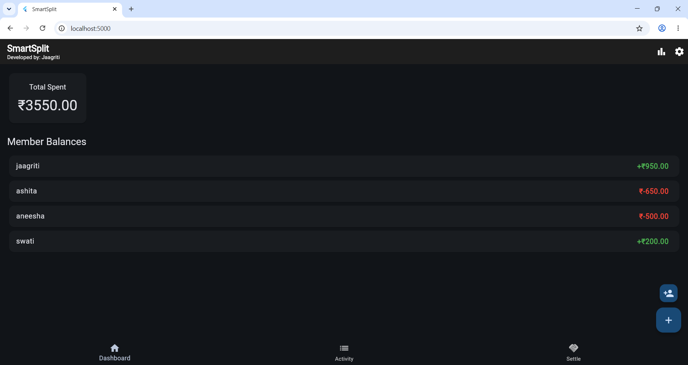
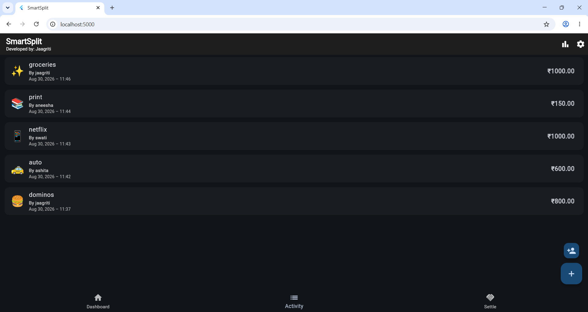
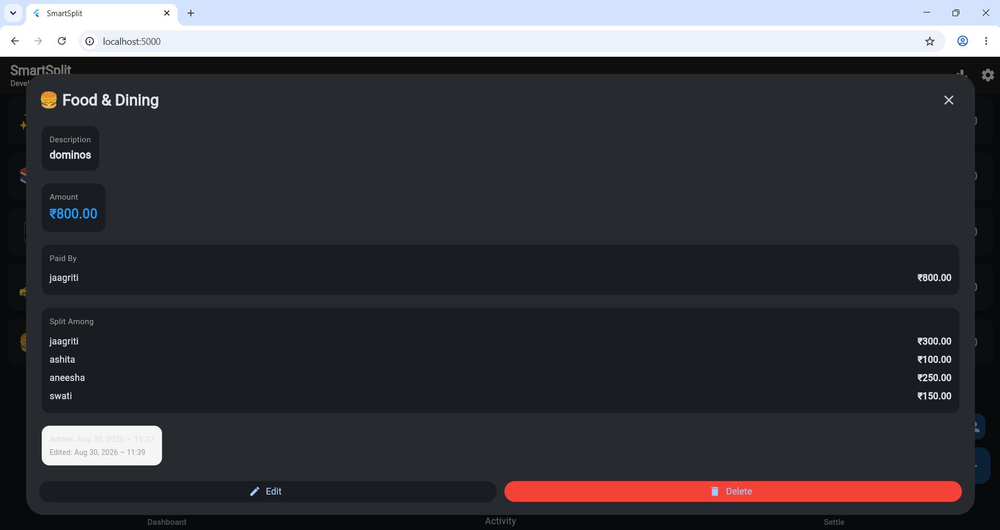
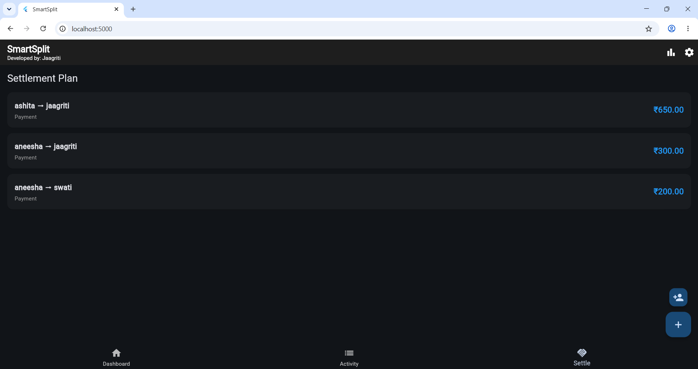
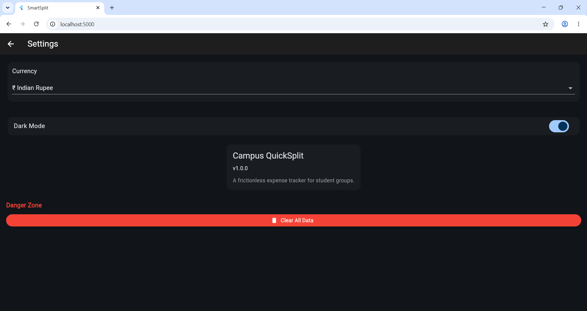
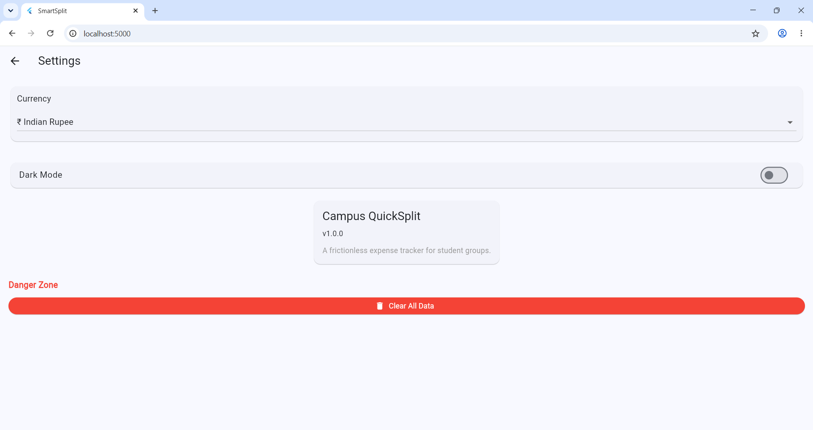
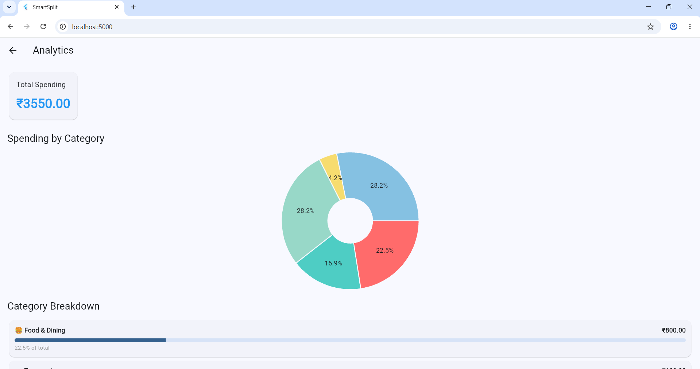
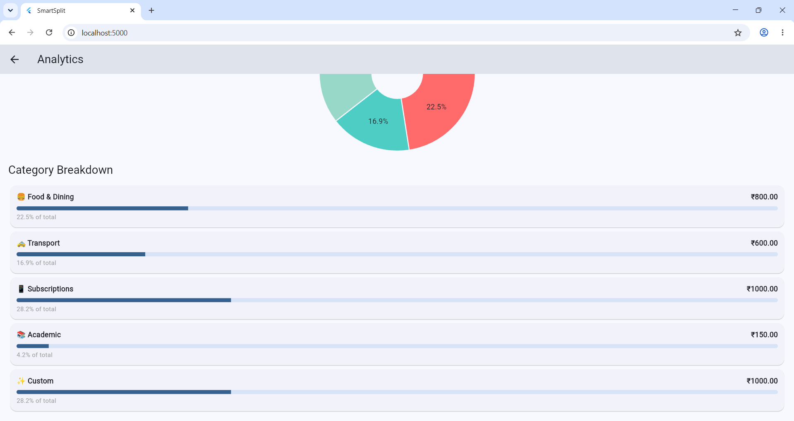

# SmartSplit 🚀

**Frictionless Local-First Peer Expense Tracker for Students**

## Problem Statement
Students frequently manage shared group expenses with uneven splits (auto rides, subscriptions, food bills, printouts). Existing platforms require signups, cloud sync, and complex onboarding. SmartSplit solves this locally, offline-first.

## Features ✨

### Phase 1 (Completed)
- ✅ Equal distribution splits
- ✅ Dashboard with balance view
- ✅ Activity log with timestamps
- ✅ Input validation
- ✅ Provider state management

### Phase 2 (Completed)
- ✅ 3 split modes: Equal, Exact, Percentage
- ✅ Local-first Hive storage
- ✅ Settlement optimization (greedy algorithm)

### Phase 3 (Completed)
- ✅ Multi-payer support
- ✅ Debt simplification
- ✅ Analytics with pie charts (fl_chart)
- ✅ Undo/delete safety
- ✅ Dark/Light mode

## Tech Stack
- **Framework:** Flutter 3.47.1
- **State Management:** Provider 6.0.0
- **Local Storage:** Hive 2.2.0
- **Charts:** fl_chart
- **Date Format:** intl 0.18.0

## Getting Started

### Prerequisites
Flutter 3.47.1+
Chrome (for web testing)


### Installation
```bash
flutter pub get
```

### Run (with fixed port for persistence)
```bash
flutter run -d chrome --web-port=5000
```

**Data persists at:** `http://localhost:5000`

## Project Structure

lib/
├── main.dart # App entry
├── models/
│ ├── enums.dart # SplitType, ExpenseCategory
│ ├── expense.dart # Expense model
│ ├── group_member.dart # GroupMember model
│ └── currency.dart # Currency support
├── providers/
│ ├── expense_provider.dart
│ ├── group_provider.dart
│ ├── currency_provider.dart
│ └── theme_provider.dart
├── services/
│ ├── hive_service.dart # Persistence
│ └── settlement_calculator.dart # Debt math
├── screens/
│ ├── home_screen.dart
│ ├── add_expense_screen.dart
│ ├── expense_details_modal.dart
│ ├── manage_group_screen.dart
│ ├── analytics_screen.dart
│ └── settings_screen.dart
├── widgets/
│ ├── dashboard_tab.dart
│ ├── activity_tab.dart
│ └── settlement_tab.dart
└── utils/
├── validators.dart
└── split_calculator.dart


## Key Algorithms

### Settlement Optimization
Greedy algorithm pairs largest debtors with largest creditors, minimizing transaction count.

Example:
Input: A owes 100, B owes 50, C is owed 150
Output: A → C: 100, B → C: 50 (2 transactions vs 3)


### Split Modes
- **Equal:** `amount / members_count` with remainder handling
- **Exact:** Manual allocation with real-time balance tracking
- **Percentage:** Validated to sum to 100% (±0.05% tolerance)

## Usage

1. **Add Members:** Tap "+" button → Enter name
2. **Add Expense:** Tap FAB → Fill details
3. **Split Selection:**
   - Select all members (default) OR
   - Deselect "All" to pick specific members
4. **Who Paid:** Multi-select members who contributed
5. **View Settlement:** Settle tab shows simplified debts

## Known Limitations
- No cloud sync (intentional - offline-first philosophy)
- Single device only
- Fixed port required for persistence

## Future Enhancements
- QR code sharing for group setup
- Push notifications for settlements
- CSV export
- Multi-language support
- Multiple groups
- Login or local options

## Author
Jaagriti Mandal — GDG App Dev Round 2 Submission











## Video Demo
Google Drive Link: 

## License
MIT